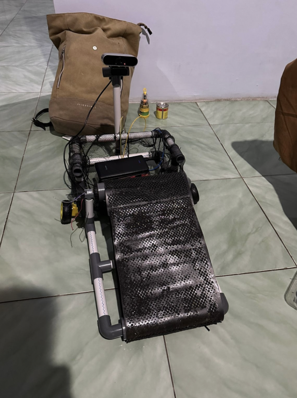
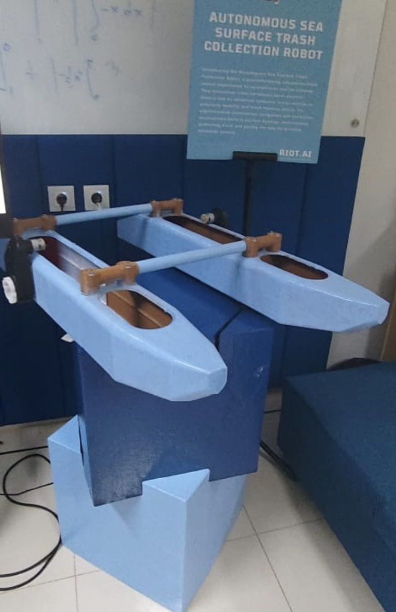
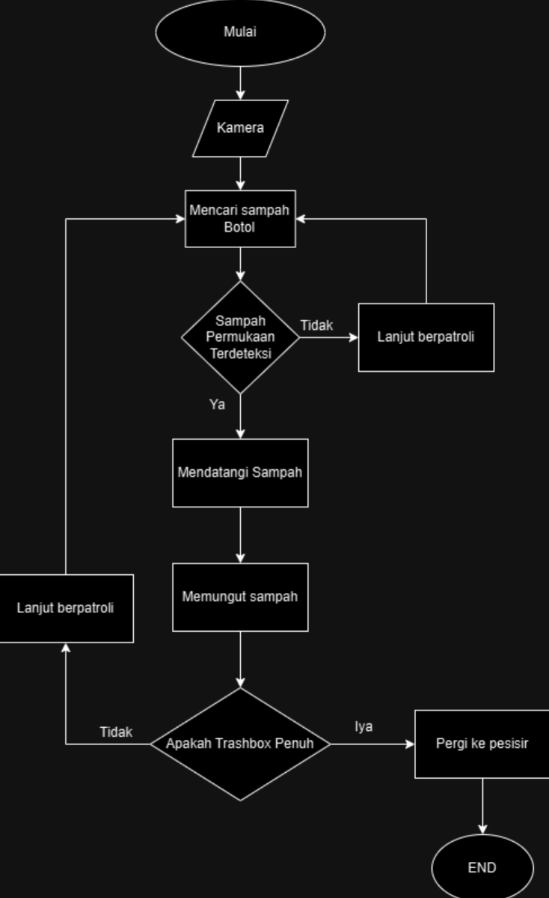

# Project-RPSLO

[](https://github.com/FranklinJaya2006/Project-RPSLO/graphs/contributors)

[contributors-shield]: https://img.shields.io/github/contributors/FranklinJaya2006/Project-RPSLO.svg?style=for-the-badge

[](https://www.linkedin.com/in/franklin-jaya-6a3697364/) [](https://www.linkedin.com/in/kurokusaa/) [](https://www.linkedin.com/in/muh-ryan-ardiansyah-b72404293/)

[linkedin-shield]: https://img.shields.io/badge/LinkedIn-0A66C2?style=for-the-badge&logo=linkedin&logoColor=white


<!-- PROJECT LOGO -->
<br />


<!-- TABLE OF CONTENTS -->
<details>
  <summary>Table of Contents</summary>
  <ol>
    <li>
      <a href="#about-the-project">About The Project</a>
      <ul>
        <li><a href="#built-with">Built With</a></li>
        <li><a href="#project-dependencies">Project Dependencies</a></li>
      </ul>
    </li>
    <li>
      <a href="#getting-started">Getting Started</a>
      <ul>
        <li><a href="#prerequisites">Prerequisites</a></li>
        <li><a href="#installation">Installation</a></li>
        <li><a href="#verify-yolov8-installation">Verify YOLOv8 Installation</a></li>
      </ul>
    </li>
    <li>
      <a href="#usage">Usage</a>
    </li>
    <li>
      <a href="#roadmap">Roadmap</a>
    </li>
    <li>
      <a href="#contact">Contact</a>
    </li>
    <li>
      <a href="#Development-Team">Development Team</a>
    </li>
  </ol>
</details>


<!-- ABOUT THE PROJECT -->
## About The Project

<p align="center">
  
  
</p>

Project-RPSLO is an IoT-based autonomous marine waste collection system designed to help reduce floating trash pollution in ocean and coastal environments.

The project utilizes a webcam integrated with YOLOv8 artificial intelligence object detection technology to identify floating waste objects in real time. Detected objects are then processed by the system to support autonomous navigation and waste collection mechanisms on the boat.

This system was developed to provide a smarter and more efficient solution for monitoring and collecting marine debris using computer vision and embedded system technology.

Main features include:

- Real-time marine waste detection using YOLOv8
- Webcam-based object recognition system
- Autonomous or semi-autonomous boat navigation
- Raspberry Pi integration
- Real-time image processing using OpenCV
- Floating waste monitoring system
- AI-assisted environmental cleaning technology

The detection system continuously captures visual data from the webcam, processes the image using YOLOv8, and identifies trash objects such as plastic waste or floating debris in water environments.

This project also supports the United Nations Sustainable Development Goals (SDGs), especially:

- SDG 14 — Life Below Water
- SDG 11 — Sustainable Cities and Communities
- SDG 13 — Climate Action

<p align="right">(<a href="#readme-top">back to top</a>)</p>

### Built With

This section should list any major frameworks/libraries used to bootstrap your project. Leave any add-ons/plugins for the acknowledgements section. Here are a few examples.

<a href="https://ultralytics.com/">
  
</a>

<a href="https://www.python.org/">
  
</a>

<p align="right">(<a href="#readme-top">back to top</a>)</p>

### Project Dependencies

This project uses:

- YOLOv8 for object detection
- OpenCV for camera processing
- RPi.GPIO for Raspberry Pi GPIO control

Example imports used in the project:

```python
import cv2
import RPi.GPIO as GPIO
from ultralytics import YOLO
```

## Getting Started

Follow these steps to set up the YOLOv8 project locally using Python virtual environment (`venv`).

### Prerequisites

Make sure you have installed:

- Python 3.10+
- pip
- Git

Check your installation:

```sh
python --version
pip --version
git --version
```

---

### Installation

1. Clone the repository

```sh
git clone https://github.com/your_username/your_repository.git
```

2. Navigate to the project folder

```sh
cd your_repository
```

3. Create a virtual environment

```sh
python -m venv venv
```

4. Activate the virtual environment

**Windows**
```sh
venv\Scripts\activate
```

**Linux / macOS / Raspberry Pi**
```sh
source venv/bin/activate
```

5. Install required dependencies

```sh
pip install ultralytics opencv-python
```

For Raspberry Pi GPIO support:

```sh
pip install RPi.GPIO
```

6. Download YOLOv8 model weights

Example:

```sh
wget https://github.com/ultralytics/assets/releases/download/v0.0.0/yolov8s.pt
```

Or manually download the model from:

- https://github.com/ultralytics/ultralytics

7. Run the project

```sh
python roda.py
```

---

### Verify YOLOv8 Installation

```sh
yolo version
```

If installed correctly, the YOLOv8 version information will appear.

<p align="right">(<a href="#readme-top">back to top</a>)</p>


<!-- USAGE EXAMPLES -->
## Usage

Project-RPSLO is an IoT-based autonomous garbage collection boat designed to help detect and collect floating waste in marine environments using computer vision technology.

The system utilizes YOLOv8 object detection to identify trash objects in real time through a camera mounted on the boat. Detected waste data is then processed by the Raspberry Pi to support navigation and waste collection mechanisms.

Main features:

- Real-time trash detection using YOLOv8
- Camera-based object recognition
- Raspberry Pi GPIO control
- Autonomous or semi-autonomous boat navigation
- Floating waste monitoring system
- Real-time image processing using OpenCV

System workflow:
<p align="center">
  
</p>

<p align="right">(<a href="#readme-top">back to top</a>)</p>

## Roadmap
For further development:
<p align="center">
  
</p>

<!-- CONTACT -->
## Contact

Franklin Jaya - [@franklinjaya_](https://www.instagram.com/franklinjaya_/) - franklinjaya827@gmail.com - [Franklin_Github](https://github.com/FranklinJaya2006)

<p align="right">(<a href="#readme-top">back to top</a>)</p>

## Development Team

Proyek ini dikembangkan oleh tim **Jobaile Development Team**, yang terdiri dari:

1. **Apryadi Dwi Putra Tangalayuk**  
2. **Franklin Jaya** 
3. **Muh. Ryan Ardiansyah** 


<!-- MARKDOWN LINKS & IMAGES -->
<!-- https://www.markdownguide.org/basic-syntax/#reference-style-links -->
[Python.org]: https://img.shields.io/badge/Python-3776AB?style=for-the-badge&logo=python&logoColor=white
[Python-url]: https://www.python.org/
[YOLO.org]: https://img.shields.io/badge/YOLO-Ultralytics-111111?style=for-the-badge
[YOLO-url]: https://ultralytics.com/
